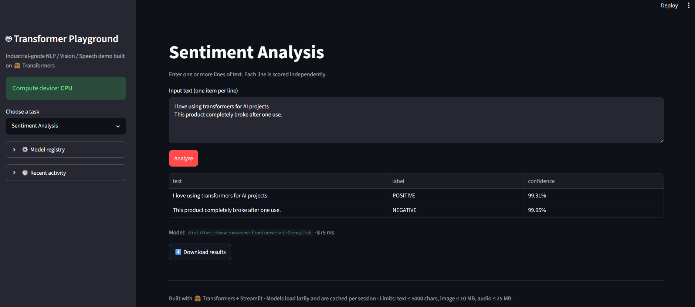
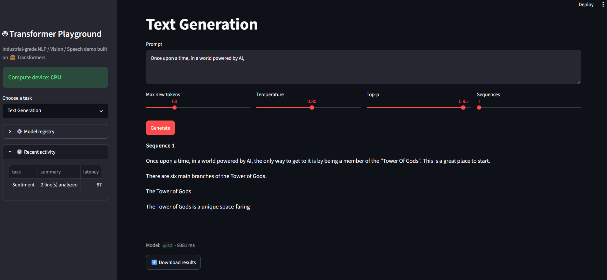
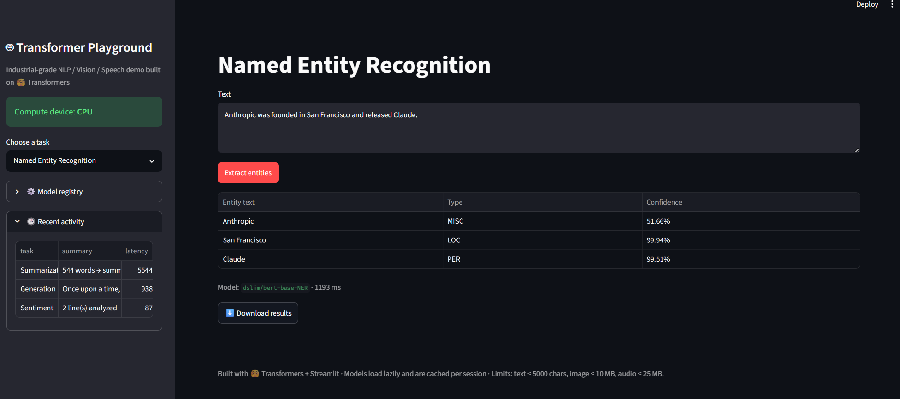
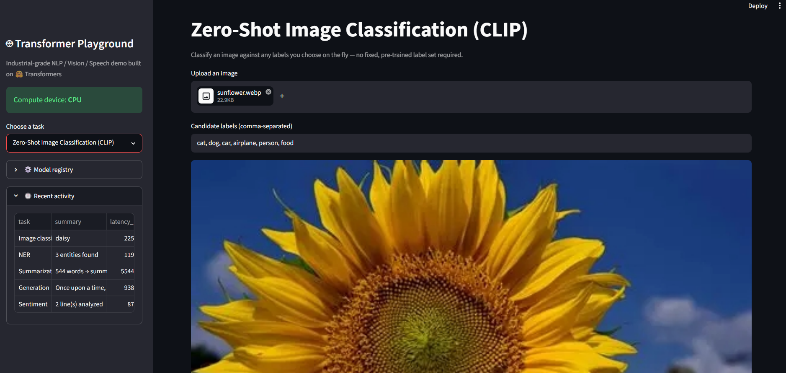

# 🤖 Transformer Playground

An industrial-grade **Streamlit** application that puts seven Hugging Face 🤗 Transformers pipelines - spanning **NLP, Computer Vision, and Speech** - behind a single, production-style interface with lazy model loading, centralized configuration, input validation, and unit-tested utilities.


---

## Overview

Transformer Playground is a multi-task ML demo app built to reflect real production practices rather than a single-file notebook script. It exposes seven Hugging Face pipelines through one Streamlit UI, with a clean separation between **presentation** (`app.py`), **inference** (`core/engine.py`), **configuration** (`core/config.py`), and **validation** (`core/utils.py`) - each independently testable and swappable.

**Supported tasks:**

| Task | Pipeline | Default Model |
|---|---|---|
| Sentiment Analysis (batch) | `sentiment-analysis` | `distilbert-base-uncased-finetuned-sst-2-english` |
| Text Generation | `text-generation` | `gpt2` |
| Summarization | `summarization` | `facebook/bart-large-cnn` |
| Named Entity Recognition | `ner` | `dslim/bert-base-NER` |
| Image Classification | `image-classification` | `google/vit-base-patch16-224` |
| Zero-Shot Image Classification | CLIP | `openai/clip-vit-base-patch32` |
| Automatic Speech Recognition | `automatic-speech-recognition` | `openai/whisper-small` |

---

## Key Engineering Highlights

- **Lazy, cached model loading** - every model sits behind its own `@st.cache_resource` getter, so nothing is downloaded or loaded into memory until its task is actually used, and it's reused for the life of the server process.
- **Environment-driven configuration** - every model ID and limit (`SENTIMENT_MODEL`, `MAX_TEXT_CHARS`, `MAX_IMAGE_MB`, etc.) is overridable via environment variables, so the same codebase runs on a low-memory box or a GPU server without code changes.
- **Automatic CPU/GPU device selection** - detects CUDA at startup and routes every pipeline to the right device.
- **Layered architecture** - `app.py` is presentation-only; all inference logic lives in `core/engine.py` and all input validation in `core/utils.py`, which has zero Streamlit or model dependencies and is fully unit-testable.
- **Uniform error handling** - every inference call is wrapped and re-raised as a user-safe `InferenceError`, with full tracebacks logged for operators but never leaked to the UI.
- **Input validation & guardrails** - text length, image size/format, and audio size are all validated before hitting a model, with configurable limits.
- **Safe summarization truncation** - long inputs are truncated against the tokenizer's true max length (instead of crashing with a low-level embedding index error) and the user is warned when truncation occurs.
- **Batch-capable sentiment analysis** - score multiple lines of text in a single request.
- **Zero-shot image classification with CLIP** - classify images against arbitrary, user-defined labels at runtime, no fixed label set required.
- **Session activity log & JSON/text export** - every run is logged in-session and downloadable as JSON or plain text.
- **Containerized** — a production-ready multi-stage-friendly `Dockerfile` with `ffmpeg` for audio decoding and a built-in `HEALTHCHECK`.
- **Unit tested** — `tests/test_utils.py` covers all validation logic with `pytest`, independent of any model weights.

---

## Project Structure

```
.
├── app.py                  # Streamlit UI — presentation layer only
├── core/
│   ├── __init__.py
│   ├── config.py            # Centralized, env-driven settings
│   ├── engine.py             # Lazy-cached model loaders + inference functions
│   └── utils.py               # Pure-Python input validation & formatting
├── tests/
│   └── test_utils.py         # Unit tests for core/utils.py (pytest)
├── screenshots/
│   ├── Sentiment_analysis.png
│   ├── Text_generation.png
│   ├── Summarization.png
│   ├── NER.png
│   ├── Image_classification.png
│   └── CLIP.png
├── Dockerfile
├── requirements.txt
├── README.md
└── .gitignore
```

---

## Getting Started

### Prerequisites
- Python 3.11+
- pip
- (Optional) NVIDIA GPU + CUDA for faster inference — the app automatically falls back to CPU

### Local Setup

```bash
# 1. Clone the repository
git clone https://github.com/Chowdri-Furkhan07/transformer-playground.git
cd transformer-playground

# 2. Create and activate a virtual environment
python -m venv venv
source venv/bin/activate      # Windows: venv\Scripts\activate

# 3. Install dependencies
pip install -r requirements.txt

# 4. Run the app
streamlit run app.py
```

The app will be available at **http://localhost:8501**.

### Run with Docker

```bash
docker build -t transformer-playground .
docker run -p 8501:8501 transformer-playground
```

### Run the Tests

```bash
pytest tests/
```

---

## Configuration

All settings are environment-variable driven with sensible defaults (see `core/config.py`). Create a `.env` file in the project root to override any of them:

| Variable | Default | Description |
|---|---|---|
| `SENTIMENT_MODEL` | `distilbert-base-uncased-finetuned-sst-2-english` | Sentiment analysis model |
| `GENERATION_MODEL` | `gpt2` | Text generation model |
| `SUMMARIZATION_MODEL` | `facebook/bart-large-cnn` | Summarization model |
| `NER_MODEL` | `dslim/bert-base-NER` | Named entity recognition model |
| `IMAGE_CLASSIFICATION_MODEL` | `google/vit-base-patch16-224` | Image classification model |
| `CLIP_MODEL` | `openai/clip-vit-base-patch32` | Zero-shot image classification model |
| `ASR_MODEL` | `openai/whisper-small` | Speech recognition model |
| `MAX_TEXT_CHARS` | `5000` | Max characters per text input |
| `MAX_IMAGE_MB` | `10` | Max uploaded image size (MB) |
| `MAX_AUDIO_MB` | `25` | Max uploaded audio size (MB) |
| `MAX_BATCH_LINES` | `50` | Max lines per batch sentiment request |
| `LOG_LEVEL` | `INFO` | Python logging level |
| `ENABLE_TELEMETRY` | `false` | Reserved flag for future telemetry hooks |

---

## Screenshots

| Sentiment Analysis | Text Generation | Summarization |
|---|---|---|
|  |  |  |

| Named Entity Recognition | Image Classification | Zero-Shot CLIP |
|---|---|---|
|  |  |  |

---

## Tech Stack

**Language:** Python 3.11
**Frontend / App Framework:** Streamlit
**ML Framework:** Hugging Face Transformers, PyTorch
**Data Handling:** Pandas, Pillow, sentencepiece
**Testing:** pytest
**Containerization:** Docker

---

## Roadmap

- [ ] Add multi-language support for NLP tasks
- [ ] Add model benchmarking / latency comparison view
- [ ] Add authentication for shared/public deployments
- [ ] Add persistent (database-backed) request history

---

## Author

**Chowdri Furkhan**

Data Analyst | AI&ML Engineer

GitHub: [@Chowdri-Furkhan07](https://github.com/Chowdri-Furkhan07)

---

## License

This project is licensed under the [MIT License](LICENSE).
